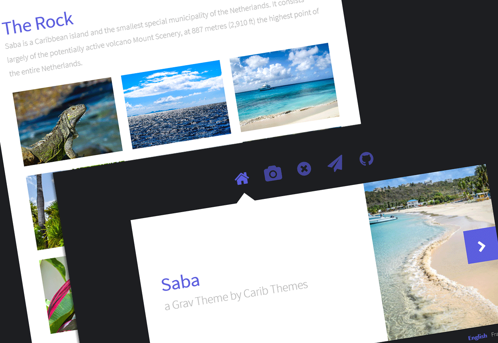

# Saba Theme for the CMS Grav

> **Saba** is a **FREE** minimalist Photo Theme ported by [**CaribThemes**](http://caribthemes.io) for the [**Grav**](http://getgrav.org) CMS and inspired by Astral by HTML5up.

##### Table of Contents:

* [Demo](#demo)
* [Features](#features)
* [Installation](#installation)
* [Support & Bugs](#support--bugs)
* [Credits](#credits)

## Demo

See the **Saba** Template live [here](http://caribthemes.io/demo/saba)

## Features
* Fully Responsive
* HTML5 and CSS3
* Photo Gallery with lightBox
* Fontawesome icon support 4.5.0 (CDN) [See the list here.](http://fortawesome.github.io/Font-Awesome/icons)
* Contact Form
* Multilingual ready - (demo in :uk: & :fr:)
* Custom Error page
* Back to top

## Installation

### Basic Setup for a new Grav site

The simplest way to install Saba Theme for Grav is to download and install the Saba Skeleton package:

* Download [Saba Skeleton on Grav](http://getgrav.org/downloads/skeletons#extras) or the latest release on [GitHub](https://github.com/CaribThemes/grav-skeleton-saba/releases).
* Simply unzip the package into your web root folder.
* Point your browser at the folder, job done!

> TIP: Check out the general [Grav installation instructions](http://learn.getgrav.org/basics/installation) for more details on this process.

### Existing Grav site

It is possible to install just the theme, but page content will need to reference the Saba theme's supported templates. It is strongly advised to at least install the Saba Skeleton package to see the theme's capabilities in action.

To install **just** the theme:

<code>$ bin/gpm install saba</code>

>> NOTE: This theme is a modular component for Grav which requires the [Grav](http://github.com/getgrav/grav), [Error](https://github.com/getgrav/grav-theme-error) and [Problems](https://github.com/getgrav/grav-plugin-problems) plugins.

>> Contact Form Configuration
For contact form configuration instructions please refer to [official documentation](http://learn.getgrav.org/advanced/contact-form). Make sure you installed Email and simple_form plugin though.

## Support & Bugs
* If you need a support please go to the dedicated 
* If you find bugs, please report them on [here](https://github.com/CaribThemes/grav-theme-saba/issues)

## Credits
* [Grav](http://getgrav.org) by [RocketTheme](http://www.rockettheme.com). Licensed under [MIT](https://github.com/CaribThemes/grav-theme-saba/master/LICENSE.md)
* Photos by MATsxm for [IDIM<em>web</em>.com](http://idimweb.com). Licensed under __WTFPL__ (see LICENSE)
* Inspired by the template Astral by [HTML5 up](http://html5up.net/)
* [LightBox2](https://github.com/lokesh/lightbox2) by Lokesh
* [Back To Top](https://github.com/CodyHouse/back-to-top) feature by [CodyHouse](https://github.com/CodyHouse)

>> __DISCLAIMER__

>>Note that @Sandra97 has never been involved in the CSS excepted for having killed few _!important;_ :stuck_out_tongue:

[CaribThemes](http://caribthemes.io), free web resources is proudly brought to you by [IDIM<em>web</em>.com](http://idimweb.com)
